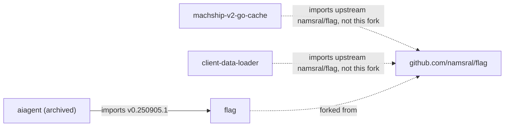

```mermaid
flowchart LR
  %% The only importer of github.com/machship/flag is the archived aiagent repo.
  aiagent["aiagent (archived)"] -->|imports v0.250905.1| flag
  machship-v2-go-cache -.->|"imports upstream namsral/flag, not this fork"| namsral-flag["github.com/namsral/flag"]
  client-data-loader -.->|"imports upstream namsral/flag, not this fork"| namsral-flag
  flag -.->|forked from| namsral-flag
```

Solid line: build-time import of this fork. Dotted lines: repos on the map that still use the
upstream module, shown for context only.
